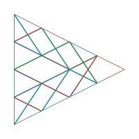

<p align="center">
  
</p>

<pre align="center">
 ███████╗██╗   ██╗███╗   ██╗██╗██╗  ██╗
 ██╔════╝╚██╗ ██╔╝████╗  ██║██║╚██╗██╔╝
 ███████╗ ╚████╔╝ ██╔██╗ ██║██║ ╚███╔╝
 ╚════██║  ╚██╔╝  ██║╚██╗██║██║ ██╔██╗
 ███████║   ██║   ██║ ╚████║██║██╔╝ ██╗
 ╚══════╝   ╚═╝   ╚═╝  ╚═══╝╚═╝╚═╝  ╚═╝
</pre>

<h3 align="center">A build system for agent memory.</h3>

<p align="center">
  <video src="./templates/02-tv-returns/tv_returns.mp4" width="720" controls></video>
</p>

## The Problem

Agent memory hasn't converged. Mem0, Letta, Zep, LangMem — each bakes in a different architecture because the right one depends on your domain and changes as your agent evolves. Most systems force you to commit to a schema early. Changing your approach means migrations or starting over.

## What Synix Does

Conversations are sources. Prompts are build rules. Summaries and world models are artifacts. Declare your memory architecture in Python, build it, then change it — only affected layers rebuild. Trace any artifact back through the dependency graph to its source conversation.

```bash
uvx synix build pipeline.py
uvx synix search "return policy"
uvx synix validate                # experimental
```

## Quick Start

```bash
uvx synix init my-project
cd my-project
```

Add your API key (see `pipeline.py` for provider config), then build:

```bash
uvx synix build
```

Browse, search, and validate:

```bash
uvx synix list                    # all artifacts, grouped by layer
uvx synix show final-report       # render an artifact
uvx synix search "hiking"         # full-text search
uvx synix validate                # run declared validators (experimental)
```

## Defining a Pipeline

A pipeline is a Python file. Layers are real objects with dependencies expressed as object references.

```python
# pipeline.py
from synix import Pipeline, Source, SearchIndex
from synix.ext import MapSynthesis, ReduceSynthesis

pipeline = Pipeline("my-pipeline")
pipeline.source_dir = "./sources"
pipeline.build_dir = "./build"
pipeline.llm_config = {
    "provider": "anthropic",
    "model": "claude-haiku-4-5-20251001",
    "temperature": 0.3,
    "max_tokens": 1024,
}

# Parse source files
bios = Source("bios", dir="./sources/bios")

# 1:1 — apply a prompt to each input
work_styles = MapSynthesis(
    "work_styles",
    depends_on=[bios],
    prompt="Infer this person's work style in 2-3 sentences:\n\n{artifact}",
    artifact_type="work_style",
)

# N:1 — combine all inputs into one output
report = ReduceSynthesis(
    "report",
    depends_on=[work_styles],
    prompt="Write a team analysis from these profiles:\n\n{artifacts}",
    label="team-report",
    artifact_type="report",
)

pipeline.add(bios, work_styles, report)
pipeline.add(SearchIndex("search", sources=[work_styles, report], search=["fulltext"]))
```

This is a complete, working pipeline. `uvx synix build pipeline.py` runs it.

For the full pipeline API, built-in transforms, validators, and advanced patterns, see [docs/pipeline-api.md](docs/pipeline-api.md).

## Configurable Transforms (`synix.ext`)

Most LLM steps follow one of four patterns. The `synix.ext` module provides configurable transforms for each — no custom classes needed.

```python
from synix.ext import MapSynthesis, GroupSynthesis, ReduceSynthesis, FoldSynthesis
```

| Transform | Pattern | Use when... |
|-----------|---------|-------------|
| `MapSynthesis` | 1:1 | Each input gets its own LLM call |
| `GroupSynthesis` | N:M | Group inputs by a metadata key, one output per group |
| `ReduceSynthesis` | N:1 | All inputs become a single output |
| `FoldSynthesis` | N:1 sequential | Accumulate through inputs one at a time |

All four take a `prompt` string with placeholders like `{artifact}`, `{artifacts}`, `{group_key}`, `{accumulated}`. Changing the prompt automatically invalidates the cache.

For full parameter reference and examples of each, see [docs/pipeline-api.md#configurable-transforms](docs/pipeline-api.md#configurable-transforms-synixext).

When you need logic beyond prompt templating — filtering, conditional branching, multi-step chains — write a [custom Transform subclass](docs/pipeline-api.md#custom-transforms).

## Built-in Transforms

Pre-built transforms for common agent memory patterns. Import from `synix.transforms`:

| Class | What it does |
|-------|-------------|
| `EpisodeSummary` | 1 transcript → 1 episode summary |
| `MonthlyRollup` | Group episodes by month, synthesize each |
| `TopicalRollup` | Group episodes by user-defined topics |
| `CoreSynthesis` | All rollups → single core memory document |
| `Merge` | Group artifacts by content similarity (Jaccard) |

## CLI Reference

| Command | What it does |
|---------|-------------|
| `uvx synix init <name>` | Scaffold a new project with sources, pipeline, and README |
| `uvx synix build` | Run the pipeline. Only rebuilds what changed |
| `uvx synix plan` | Dry-run — show what would build without running transforms |
| `uvx synix plan --explain-cache` | Plan with inline cache decision reasons |
| `uvx synix list [layer]` | List all artifacts, optionally filtered by layer |
| `uvx synix show <id>` | Display an artifact. Resolves by label or ID prefix. `--raw` for JSON |
| `uvx synix search <query>` | Full-text search. `--mode hybrid` for semantic |
| `uvx synix validate` | *(Experimental)* Run validators against build artifacts |
| `uvx synix fix` | *(Experimental)* LLM-assisted repair of violations |
| `uvx synix lineage <id>` | Show the full provenance chain for an artifact |
| `uvx synix clean` | Delete the build directory |
| `uvx synix batch-build run` | *(Experimental)* Submit a batch build via OpenAI Batch API |

## Key Capabilities

**Incremental rebuilds** — Change a prompt or add new sources. Only downstream artifacts reprocess.

**Full provenance** — Every artifact chains back to the source conversations that produced it. `uvx synix lineage <id>` shows the full tree.

**Fingerprint-based caching** — Build fingerprints capture inputs, prompts, model config, and transform source code. Change any component and only affected artifacts rebuild. See [docs/cache-semantics.md](docs/cache-semantics.md).

**Altitude-aware search** — Query across episode summaries, rollups, or core memory. Drill into provenance from any result.

**Architecture evolution** — Swap monthly rollups for topic-based clustering. Transcripts and episodes stay cached. No migration scripts.

## Where Synix Fits

| | Mem0 | Letta | Zep | LangMem | **Synix** |
|---|---|---|---|---|---|
| **Approach** | API-first memory store | Agent-managed memory | Temporal knowledge graph | Taxonomy-driven memory | Build system with pipelines |
| **Incremental rebuilds** | — | — | — | — | Yes |
| **Provenance tracking** | — | — | — | — | Full chain to source |
| **Architecture changes** | Migration | Migration | Migration | Migration | Rebuild |
| **Schema** | Fixed | Fixed | Fixed | Fixed | You define it |

Synix is not a memory store. It's the build system that produces one.

## Learn More

| Doc | Contents |
|-----|----------|
| [Pipeline API](docs/pipeline-api.md) | Full Python API — ext transforms, built-in transforms, projections, validators, custom transforms |
| [Entity Model](docs/entity-model.md) | Artifact identity, storage format, cache logic |
| [Cache Semantics](docs/cache-semantics.md) | Rebuild trigger matrix, fingerprint scheme |
| [Batch Build](docs/batch-build.md) | *(Experimental)* OpenAI Batch API for 50% cost reduction |
| [CLI UX](docs/cli-ux.md) | Output formatting, color scheme |

## Links

- [synix.dev](https://synix.dev)
- [GitHub](https://github.com/marklubin/synix)
- [llms.txt](./llms.txt) — machine-readable project summary for LLMs
- [Issue tracker](https://github.com/marklubin/synix/issues) — known limitations and roadmap
- MIT License
